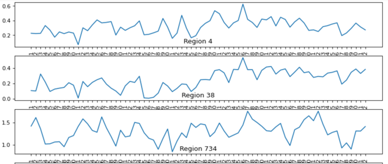
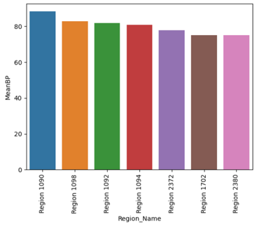
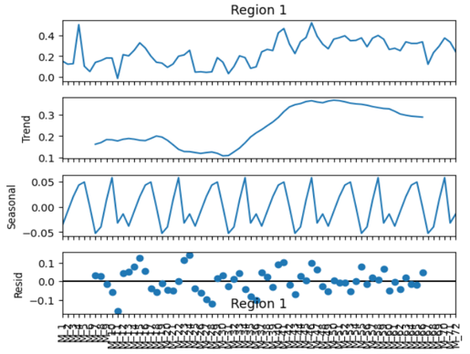
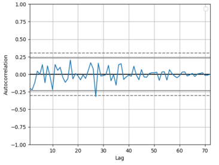
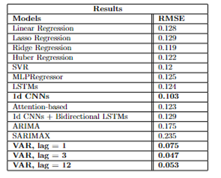
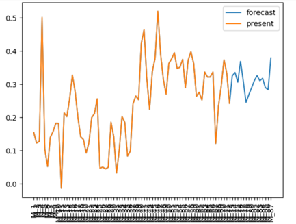
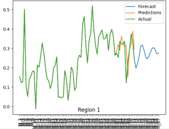

# Multivariate Time Series Forecasting
 
[Presentation](https://drive.google.com/drive/folders/1C5JF7kF4GGvhP8WgrmfDuTvXI4DgX1nF?usp=sharing)
This was a project created as a solution to the PS provided by TATA InfoCom. for the ML Hackathon conducted by Techfest, IIT B.  
It is inspired by the concept of Multivariate time series forecasting wherein multiple variables will vary over time. Each variable depends not only on its past values but also has some dependency on other variables. 
 

 
The given dataset consisted of 3915 regions and their business potential for the past 6 years (1-72 months). I was expected to build a projection of the business potential for each of the 3915 regions for the next 12 to 15 months (72-87 months) (Testing data). 
Firstly, some EDA was done wherein I looked at the variation of some regions, their distributions, and movement across months. Then, I found out the regions with maximum and minimum (mean and absolute) business potentials. 
 

 
Then comes the most important part of EDA; Trend-Seasonality-Residual Decomposition. This helped me understand the lag order and the variation in order to make the time series stationary. 
 

 
Finally, I computed the autocorrelation plot to understand the correlation with in the regions' time series and help in modeling the statistical time series.
 

 
I first modeled for each region individually using univariate series analysis and forecasting using models using classical ML models along with sequential Neural Networks and Univariate Statistical Time Series Models. After this, I used Multivariate Series Analysis wherein I considered only the regions that were correlated to the given region with a threshold greater than 0.5 using Sequential Neural Networks and Multivariate Statistical Time Series Models. The results can be seen below. 
 

 
The analysis of results reveals that the most effective model is the Vector Auto Regression (VAR) model. The VAR solution was developed by selectively incorporating correlated series to construct the sub-dataset for the concerned region. Univariate time series models demonstrated lower efficiency due to stationarity concerns, while sequential neural networks exhibited strong performance on the provided time series data, surpassing traditional machine learning models. 
Some model forecasts are as follows; 
For VAR with lag order as 3
 

 
For 1d CNNs
 

 
More improvements in forecasting can be done after understanding better properties of the series related to a region (univariate) and the impact of other regions on the concerned region (multivariate). The top 10 teams were selected and my team was not one of them (unfortunately).
 

